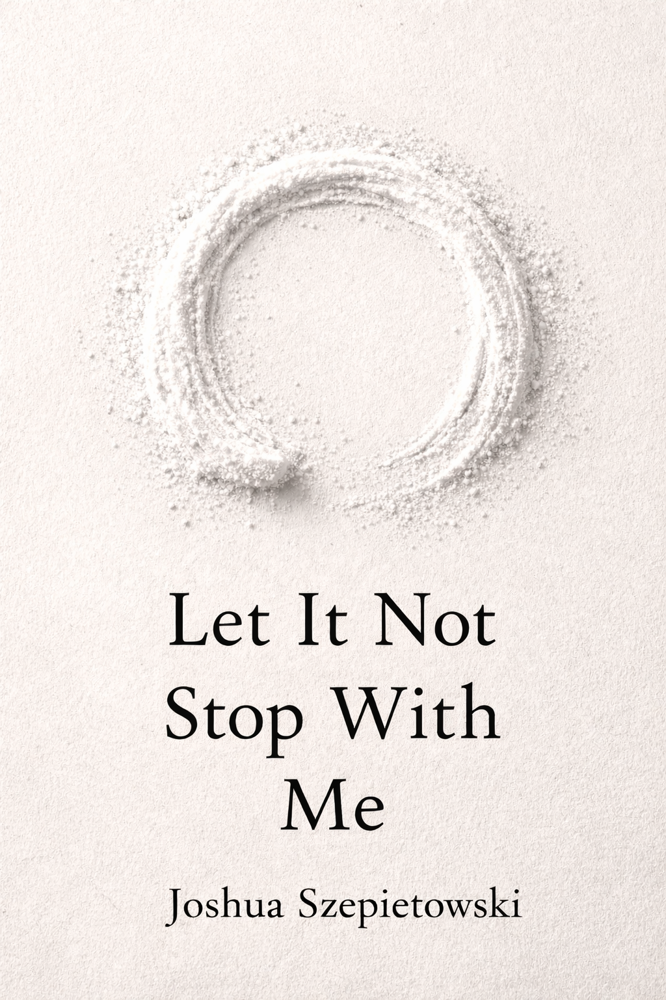

# Let It Not Stop With Me

Joshua Szepietowski

This repository contains a living manuscript.

**Let It Not Stop With Me** is a personal exploration of addiction, recovery, Buddhist practice, and the 12 Steps, written from inside the process rather than after it. It is not a guide, a teaching, or a set of answers. It is a record of reckoning, repetition, relapse, and small shifts in how I relate to the same problems over time.

This work is written without authority, certainty, or completion in mind.

## What This Is

- A witness account, not instruction  
- Practice-first, meaning-later  
- Non-linear, recursive, and sometimes contradictory  
- Grounded in behavior and consequence rather than theory  
- Written in the present tense of understanding, not from arrival  

If insight appears, it is provisional.  
If clarity appears, it is allowed to change later.  
If something is wrong on the page, it will be corrected explicitly.

## What This Is Not

- A recovery manual  
- A Buddhist text  
- A synthesis of Zen and the 12 Steps  
- A success story  
- A declaration of being “better” or “finished”  

I am not an authority on recovery, Buddhism, or the 12 Steps. I am learning them as I write.

## Structure

- `chapters/`  
  Draft chapters of the manuscript. These may change, move, contradict each other, or be discarded.

- `notes/`  
  Raw notes, fragments, and reflections that may never become chapters.

- `scripts/`  
  Code used to generate parts of the manuscript or manage the repository.

- `AGENTS.md`  
  Constraints and guardrails for how this work is allowed to be written.

- `cover.png`  
  The current working cover.

## Ethics and Boundaries

Some parts of my life are intentionally off-limits to this work. This is not an attempt at total disclosure. Care, privacy, and responsibility take precedence over completeness.

Relapse and failure are treated as expected parts of the process, not as moral failures or plot devices.

Repetition is named explicitly.  
Insight is allowed to be wrong.  
Later understanding does not claim superiority over earlier selves.

## Why This Exists

I am writing this primarily to understand my own practice and recovery more honestly.

If it resonates with someone else, if it helps even one person feel less alone in their confusion, that is a gift — not the goal.

May what passed through me not stop here.
